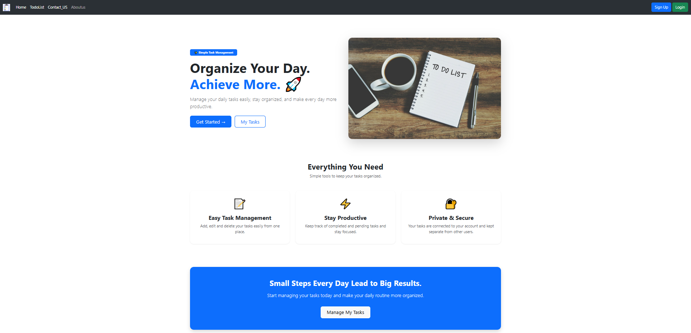
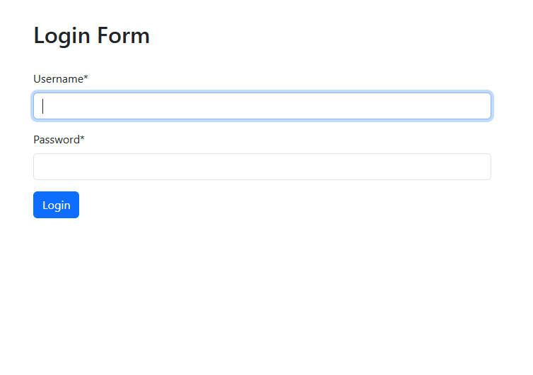
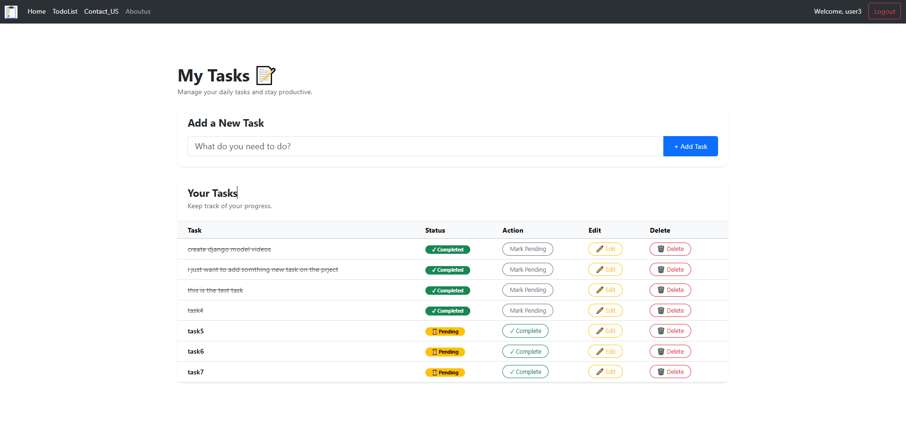
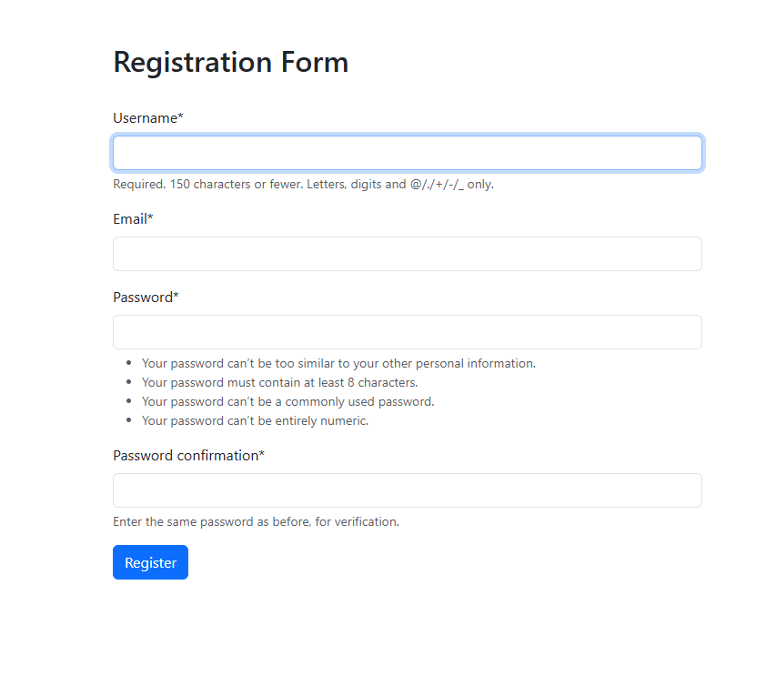
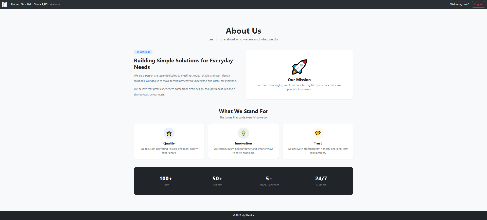

# 📝 TodoManager

A Django-based Todo Manager application with user authentication and task management.

## 📌 About the Project

TodoManager is a web-based task management application developed using Django.  
It allows users to register, log in securely, and manage their daily tasks easily.

## ✨ Features

- 👤 User Registration
- 🔐 User Login & Logout
- ➕ Add New Tasks
- ✏️ Update Tasks
- 🗑️ Delete Tasks
- ✅ Mark Tasks as Completed
- 👥 User Authentication
- 🔒 User-specific Task Management
- 📱 Responsive User Interface

## 🛠️ Technologies Used

- 🐍 Python
- 🌐 Django
- 🎨 HTML
- 🎨 CSS
- 🅱️ Bootstrap
- 🗄️ MySQL
- 🔧 Git
- 🐙 GitHub

## 📂 Project Structure

```text
todoManager/
│
├── manage.py
├── .gitignore
│
├── todoManager/
│   ├── settings.py
│   ├── urls.py
│   ├── asgi.py
│   └── wsgi.py
│
├── todolist/
│   ├── models.py
│   ├── views.py
│   ├── forms.py
│   ├── urls.py
│   └── templates/
│
├── users/
│   ├── views.py
│   ├── forms.py
│   ├── urls.py
│   └── templates/
│
├── static/
│   └── image/
│
└── templates/
    └── base.html
```

## 📸 Screenshots

### 🏠 Home Page



### 🔐 Login Page



### 📝 Todo List



### 📝 Registration Page



### 📖 About Page

